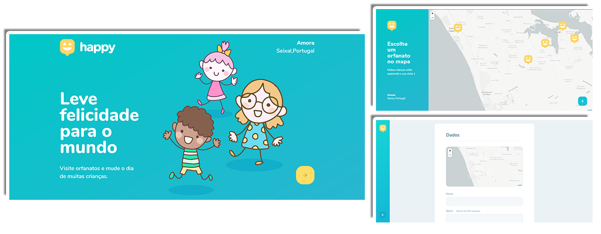
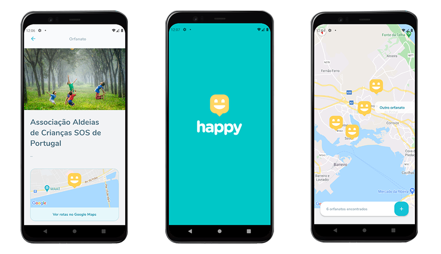

<p align="center">

</p>
<p align="center">Projeto desenvolvido durante a Next Level Week #3 da RocketSeat </p>

<br />

# Proposta
<p>Desenvolver uma aplicação web e mobile para agendar visitaa a casas de acolhimento de crianças.
A aplicação permite criar novos registros de casas com os dados, imagens e localização para a visitação.
 </p>
<br />

### :computer: Aplicação Web

<p align="center">

</p>

### :iphone: Aplicação Mobile

<p align="center">

</p>

<br />

# :rocket: Technologies

- Typescript
- React.js
- Html 5
- Css 3 / SCSS
- React Native
- Expo
- Express
- SqLite
- TypeOrm
- Node.js

<br />

# :video_game: Run

### Run API
-  Server folder

```bash
    #Instalar dependências:
    $ npm install

    # Rodar Aplicação:
    $ npm run dev
```

### Run Web Project
-  Web folder

```bash
    #Install dependencies
    $ npm install
    
    # Run application
    $ npm start
```

### Run Mobile Project
-  Mobile folder

```bash
    #Install dependencies
    $ npm install
    
    # Run application
    $ expo start
```